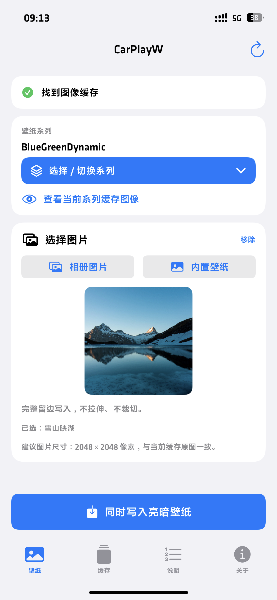
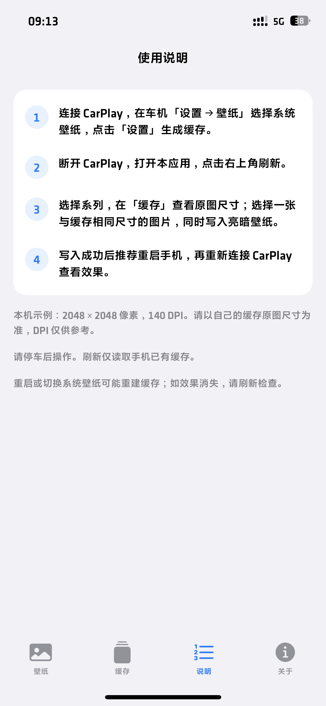
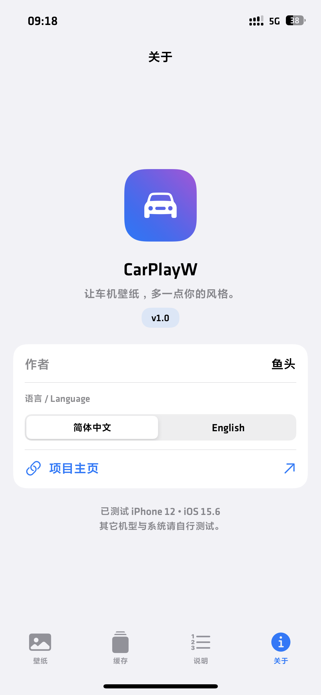
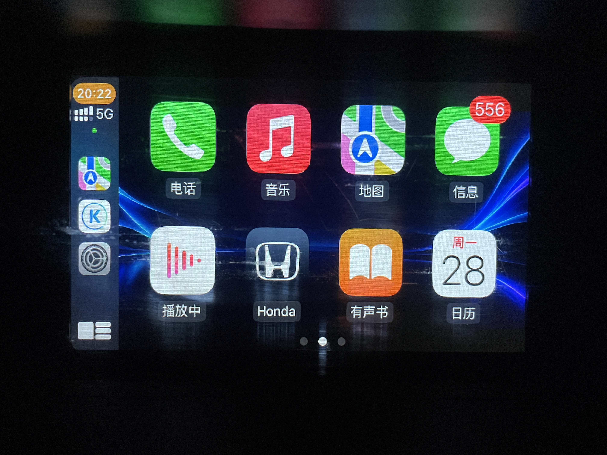

# CarPlayW

通过 TrollStore 修改 CarPlay 壁纸，一张图片同步设置亮暗外观。

Customize CarPlay wallpapers with TrollStore. One image for both light and dark appearances.

[下载 / Download v1.2](https://github.com/wxl3577/CarPlayW/releases/tag/v1.2)

## 已测试设备 / Tested device

iPhone 12（MGGM3CH/A）· iOS 15.6（19G71）· TrollStore

其它机型与系统请自行测试。Please test other devices and iOS versions yourself.

## 使用方式

用 TrollStore 安装 Releases 中的 IPA，然后：

1. 连接 CarPlay，在车机「设置 → 壁纸」选择系统壁纸，点击「设置」生成缓存。
2. 断开 CarPlay，打开本应用，点击右上角刷新。
3. 选择系列，在「缓存」TAB 查看亮/暗原图及尺寸；从「相册图片」选择一张与缓存相同尺寸的图片，或打开「内置壁纸」选择喜欢的背景，再点击「同时写入亮暗壁纸」。默认完整留边，不裁切。
4. 写入成功后可查看缓存确认效果，推荐重启手机，再重新连接 CarPlay。

当前测试设备的图片示例：**2048 × 2048 像素，140 DPI**。请以自己的缓存原图尺寸为准；140 DPI 仅为示例，不是写入限制。

1.2 保留「内置壁纸」入口，改为联网读取配置并按需下载原图。安装包不再内置五张 PNG；原有「雪山映湖」「海边童趣」「暮色灯塔」「晴空小鸟」「棕影晚霞」仍由远程列表提供。打开或刷新壁纸页时读取最新列表，上一张 / 下一张按配置顺序切换。下载完成后点击「使用这张壁纸」仅选中图片，再点击「同时写入亮暗壁纸」才会写入。加载失败可重试；无网络时仍可使用相册图片。原图备份保留在 `docs/wallpaper-originals/`，不打入应用。

请停车后操作。所选系列至少需要已有一份亮或暗缓存，缺失的一份会自动补齐。刷新仅读取手机已有缓存。

底部 TAB 分为壁纸、缓存、说明、关于，无需上下滚动。原图查看显示像素尺寸与文件大小。重启或切换系统壁纸可能重建缓存，如未生效请刷新检查。

点击蓝色「选择 / 切换系列」按钮选择其他壁纸。图片区域统一为 1:1 正方形（2048 × 2048 比例），不额外添加黑色背景；实际文件尺寸与完整留边写入规则不变，原图已有的黑边不会被裁掉。在「关于 → 语言」切换中文或 English，设置自动保存。

清理缓存：断开 CarPlay → 清除全部缓存图像 → 重复第 1、2 步。清理无备份、不可撤销。

## How to use

Install the IPA from Releases with TrollStore, then:

1. Connect CarPlay. Choose a system wallpaper in the head unit's **Settings → Wallpaper**, then tap **Set** to generate the cache.
2. Disconnect CarPlay. Open this app and tap the refresh button at the top right.
3. Choose a family and open **缓存** (Cache) to inspect available light/dark images and their dimensions. Use **Photos** to select a matching-size image, or open **Built-in** and choose a background, then tap **Apply to light & dark**. Images are fitted with black padding, never cropped.
4. Inspect the saved cache, then restart the phone as recommended and reconnect CarPlay.

Image example from the tested device: **2048 × 2048 pixels, 140 DPI**. Match your own cache's pixel dimensions; 140 DPI is an example, not a writing requirement.

Version 1.2 keeps the **Built-in** entry but fetches its catalog and original images online. The five PNGs are no longer bundled in the app. Opening or refreshing the picker loads the latest catalog; **Previous / Next** follows its order. Wait for the download, then tap **Use this wallpaper** and **Apply to light & dark**. Failed requests can be retried; Photos still works without Internet access. Original backups remain in `docs/wallpaper-originals/`, outside the app target.

Operate only while parked. At least one cached appearance must exist for the selected family; the missing counterpart is created automatically. Refresh reads existing files on the phone.

Four fixed tabs separate wallpaper editing, cache management, instructions and app information. The viewer shows pixel dimensions and file size. Restarting or changing system wallpapers may regenerate caches; refresh and check if the change disappears.

Use the blue **Select / change family** button. Images use square 1:1 display areas (the ratio of 2048 × 2048) without added black backgrounds. Actual cache sizes and aspect-fit writing remain unchanged; borders already in the image are preserved. Switch languages in **About → Language**; the preference is saved automatically.

To clear caches: disconnect → **清除全部缓存图像** (Clear all cached images) → repeat steps 1–2. There is no backup or undo.

## 软件截图 / App screenshots

  
  
  

## 实测效果 / On-device result

